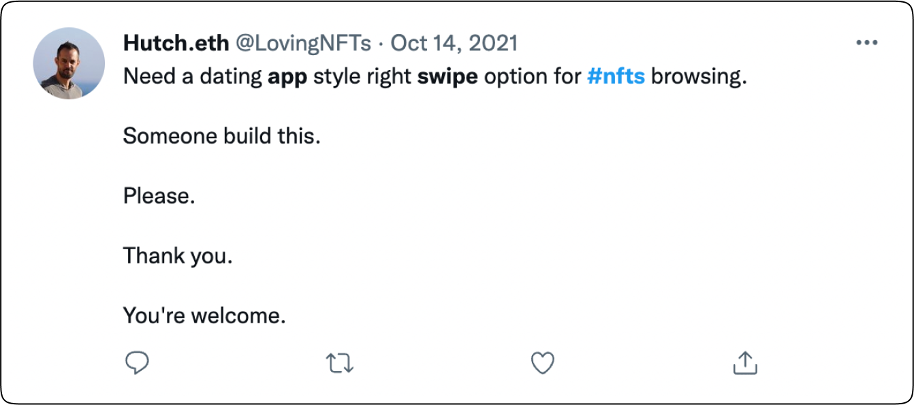
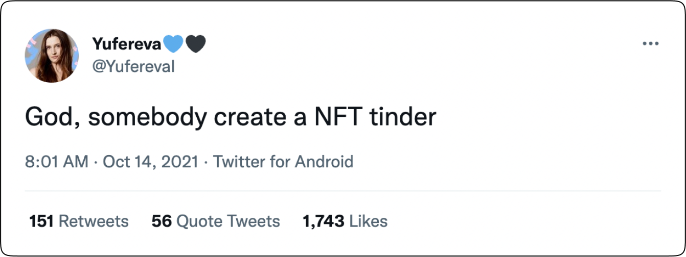
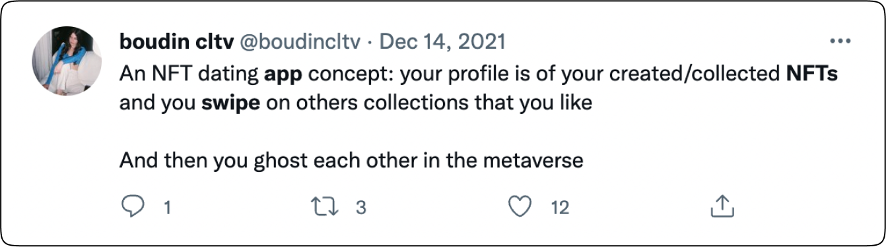

# Solana Swipe App

A simple social mobile app to meet and chat with friends on the Solana blockchain - build for Encode Club Solana Hackathon.

Contributors:

- Martins - Graphic Desgin, UX/UI, Project Lead
- Meek Msaki - Blockchan Developer/Full-Stack Developer

## What we're building


<!--  -->

## Instructions

1. Download this repository's starter repo

```
git clone https://github.com/mmsaki/swipe-solana-mobile.git
```

2. Install dependencies

```
yarn
```

3. Fire up the app

```
yarn start
```

4. Scan the QR code present on your terminal with a physical phone. Make sure to [install Expo Go](https://apps.apple.com/us/app/expo-go/id982107779) and [install the Phantom mobile app](https://phantom.app/download)!

5. For ios 16 [enable developer mode](https://docs.expo.dev/guides/ios-developer-mode/).

## Overview

Twitter citizens seem to want an NFT tinder app. We are determinded to answer their call.





## Problems our product solves

1. Identity Representation

   - The application enables users to express their unique identity through their NFT holdings rather than relying on traditional profile information.

2. NFT Discovery
   - The application provides a platform for users to discover and connect with others who share similar interests and NFT holdings.

3. Community Building
   - By facilitating connections between users based on NFT holdings, the application supports the growth and development of the web3 community. The app addresses a long-standing demand for NFT "swippable" applications in the web3 space.


## Summary

In this hackathon, we made the first steps toward functional MVP. Some features have been designed but not yet development.

Here are some of the milestones we completed:

- [x] Create Solana Program
  - [x] New user can create account
  - [x] New user can create posts
  - [x] User can match and unmatch with other users
- [x] Created ios and Android developement build
- [x] Add phantom wallet connection
- [x] Build main feed
- [x] Add swipe feature
- [x] Create profile page
- [x] Handle transaction calls from swipes and buttons
- [x] Design App leaderboard (WIP)
- [ ] NFTs quering and selection (WIP)
- [ ] Handle matches on frontend (WIP)
- [ ] Chat (WIP)
- [ ] Ledeabord (WIP)
- [ ] Options fitering matches by NFT price etc. (WIP)

<!-- ## Acknowledgements -->

<!-- Many thanks to the creators of the [Solana Course](https://github.com/Unboxed-Software/solana-course), whose on-chain program is used throughout this app. -->

