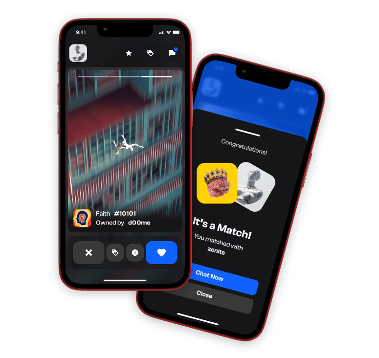

# Solana Swipe App

A simple mobile app to meet and chat with friends on the Solana blockchain - build for Encode Club Solana Hackathon.

Contributors:
- Meek Msaki - Front-End, Rust Developer/Solana Smart Contract Dev
- Martins - Graphic Desgin, UX/UI, Project Lead

## What we're building



<!--  -->

## Instructions

1. Download this repository's starter repo
```
git clone -b starter https://github.com/phantom-labs/deep-links-movie-tutorial.git
```
2. Install dependencies
```
yarn
```
3. Fire up the app
```
yarn start
```
4. Scan the QR code present on your terminal with a physical phone. Make sure to [install the Phantom mobile app](https://phantom.app/download)!


## Acknowledgements

Many thanks to the creators of the [Solana Course](https://github.com/Unboxed-Software/solana-course), whose on-chain program is used throughout this app.
